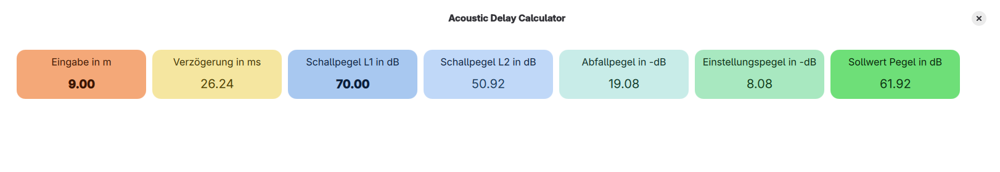

<h1 style="display: flex; align-items: center; border-bottom: none;">
  
  <span>Sdalcal</span>
</h1>
<hr>

<!-- # Sounddelay-and-Level-Calculator -->

Sdalcal stands for "Sounddelay-and-Level-Calculator" and calculates the sounddelay between two louspeaker positions with a given distance and the soundlevel for the second loudspeakers.



Hint:

- Sound pressure level ≠ sound intensity level
- L2=L1-20*log(r1/r2)
- L2=L1-10*log(r1/r2)²

#### References

1. Sengpielaudio: <https://sengpielaudio.com/Rechner-SchallUndEntfernung.htm>

## Project Requirements

This Project was created with the Open-Source-Version of Qt (Version 6.10.1).

- Download Qt: <https://www.qt.io/development/download-open-source>
- Qt Version: 6.10.1
- Qt Creator Version. 19.0.0
- Cmake Version: 3.30.5
- Ninja Version: 1.12.1

#### Install Build Essentials

For Debian, Ubuntu, Mint:

```bash
sudo apt update && sudo apt install -y \
build-essential \
cmake \
libgl1-mesa-dev \
libglu1-mesa-dev \
libfontconfig1-dev \
libx11-xcb-dev \
libxcb-xinerama0-dev \
libxcb-cursor-dev \
libxcb-shape0-dev \
libxcb-xfixes0-dev \
libxcb-render-util0-dev \
libxcb-icccm4-dev \
libxcb-keysyms1-dev \
libxcb-image0-dev \
libssl-dev \
libxkbcommon-dev \
libxkbcommon-x11-dev \
libasound2-dev \
libpulse-dev
```

For Fedora:

```bash
sudo dnf groupinstall "Development Tools" "C Development Tools and Libraries" && \
sudo dnf install -y \
cmake \
mesa-libGL-devel \
mesa-libGLU-devel \
fontconfig-devel \
libxcb-devel \
xcb-util-devel \
xcb-util-image-devel \
xcb-util-keysyms-devel \
xcb-util-renderutil-devel \
xcb-util-wm-devel \
libxkbcommon-devel \
libxkbcommon-x11-devel \
openssl-devel \
alsa-lib-devel \
pulseaudio-libs-devel
```
